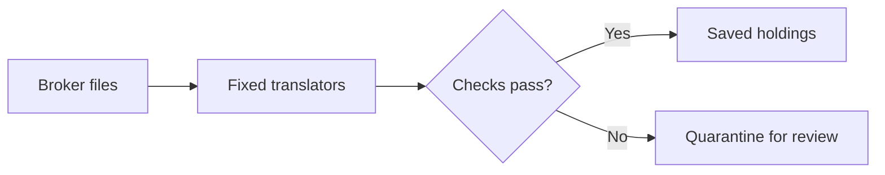

# Brokerage normalization and validation

An independent, AI-assisted Python work sample by Soham Porwal. No employer code or data.
Public vendor/author examples are preserved alongside clearly labeled synthetic edge cases.
This demonstrates data-integrity decisions; it is not a live brokerage service.

## Run it

Python 3.12 or newer; standard library only. Extract the ZIP, open a terminal in the
`brokerage-normalization` directory, and run:

```sh
python -B checkpoint.py
```

Windows alternative: `py -3.12 -B checkpoint.py`. No API keys, model, installation or network
needed. The command runs the full suite, checks source hashes, ingests seven captures into
a fresh SQLite database, restarts ingestion in another process, and verifies replay and
database integrity. It exits zero only when all acceptance checks pass.

## Try it on your own export

A raw broker export is not a capture: it carries rows, and sometimes a source date, but not
which account was observed or when. Those come from explicit flags, never from a guess and
never from the clock:

```sh
python -B broker_cli.py ingest-raw myexport.csv --broker fidelity_csv --account <id> --as-of 2026-07-02T20:00:00Z --db holdings.sqlite
```

`--broker` is never inferred from file content, and `--as-of` is never defaulted to the current
time, because download time is not observation time. No quote timestamps are invented either, so
an export without them yields a valuation marked incomplete rather than a confident total. The
snapshot id is the export's content hash, so re-running an unchanged export replays rather than
landing twice. The wrapper adds no validation and removes none: a wrapped export is judged by the
same engine, against the same contract, as the captures shipped here.

Each run saves `checkpoints/<run>/summary.json`, `normalized-output.json`, the complete test
output and an inspectable `holdings.sqlite`. Nothing overwrites a previous run.
Expected: four accepted snapshots and three quarantines. The restart adds four replay
attempts and repeats the three quarantines; accepted state stays unchanged.

To run only the tests: `python -B -m unittest discover -s tests -v`.

## The idea

Broker files describe the same things differently. Translate their fields, check identities
and numbers, and save a snapshot only after the whole snapshot passes. Uncertain inputs go
to a review queue; replaying a file must never count holdings twice.



Start with `broker_engine.py` for the rules, `broker_adapters.py` for provider fields,
`durable_store.py` for commit/replay logic, and `tests/test_broker_engine.py` for named failures.
`normalize.py` retains the original synthetic parser used by the baseline regression tests.

## Decisions worth inspecting

- **Unknown is not zero.** Null, stale, halted/delisted and expired-option prices never
  produce a complete trusted valuation. Reported prices remain visible with their limitations.
- **Ticker is not enough.** Effective-dated, reviewed aliases resolve native IDs, ticker,
  CUSIP, ISIN and FIGI. Supplied identifiers must agree. No guessed security merges.
- **Options have units.** Alpaca contract quantity and Plaid underlying-unit quantity use
  different transformations. Synthetic short positions of −2 contracts and −200 underlying
  units both normalize to −500 USD with an explicit standard multiplier of 100. The vendor
  sentences that convention rests on are quoted, hashed and dated in `sources/CITATIONS.md`.
- **Totals have a scope.** Holdings-only and holdings-plus-cash reconciliation are distinct.
  The synthetic Plaid case has 100 in holdings plus 250 cash, reconciling to 350.
- **No double counting.** Cash represented twice rejects. Pending/unsettled activities are
  recorded separately, never added again to broker-reported positions. Complete lots are
  checked against aggregate quantity and basis; missing basis remains unknown.
- **A failed refresh cannot replace good state.** Entire snapshots validate before the
  SQLite transaction commits state, accepted-delivery identity and audit together. Tests
  cover interrupted commits, restart/replay, conflicts, concurrency and partial page failures.

## Contract and limits

`captures/*.json` wraps an explicitly identified broker/account/snapshot, an offset-aware
observation time, response pages, and acquisition context. Context declares quote timestamps,
currency, cash representation, total scope, expected row count and settlement basis. These
wrappers are authored test harness inputs, not original live responses. Original example
files and provenance are in `sources/`; capture dates are not evidence of live observations.

Numbers are parsed as Decimal, never through binary float. Values have bounded precision;
reconciliation permits an explicit one-cent tolerance. Quote freshness uses elapsed time,
not a trading calendar. Supported accounts use USD or CAD separately; there is no FX total.

The approved registry and runtime code are pinned by a policy hash. Changed policies require
an explicit migration or a fresh database rather than reinterpreting old accepted state.
Quarantine stores source pointers/hashes and reason codes. Operational failures are visible
on stderr and in store `.errors.jsonl` files. No automatic queue monitoring is claimed.

Implemented profiles: Alpaca positions, a strict Plaid holdings subset, and one Fidelity
CSV test dialect. Schwab/TD and Robinhood native profiles are unsupported and quarantine.
Adjusted/index options, full corporate-action processing, live acquisition/pagination,
multi-currency account valuation and sustained production operation are outside this sample.

## Local model: development only

`examples/mapping-proposal.json` contains an actual local Qwen field-mapping proposal over
synthetic field names. `dev_mapping.py` can generate a new proposal through loopback Ollama;
it is optional and never imported by ingestion. `frozen_vendorx.py` is an independently
authored, tested demonstration transformer, not registered in runtime dispatch. It shows
what a reviewed mapping would look like as fixed code; it does not claim human approval.
Models cannot approve canonical writes. See `REVIEW.md` for the adversarial findings and fixes.

## Provenance

`sources/official-provenance.json` records pinned vendor SDK fixtures and documentation
examples; `sources/external-provenance.json` records the MIT-licensed Fidelity-shaped CSV
test fixture dated July 2, 2026. It is external synthetic data, not a verified customer export.
Original dates and licenses are preserved. `PUBLIC-MANIFEST.json` lists every packaged file
and its hash.

Full downloaded vendor documentation pages are **not redistributed** — redistributing vendor
HTML is a licensing question, so every `.html` source is deliberately excluded from this
package. `sources/CITATIONS.md` carries what matters instead: for each claim the adapters
rely on, the source URL, the sha256 and byte count of the page as retrieved, the retrieval
date, and the verbatim quoted sentence. Re-fetch the URL and compare the hash. Vendor pages
are edited over time, so a later fetch that hashes differently is expected, not suspicious.
